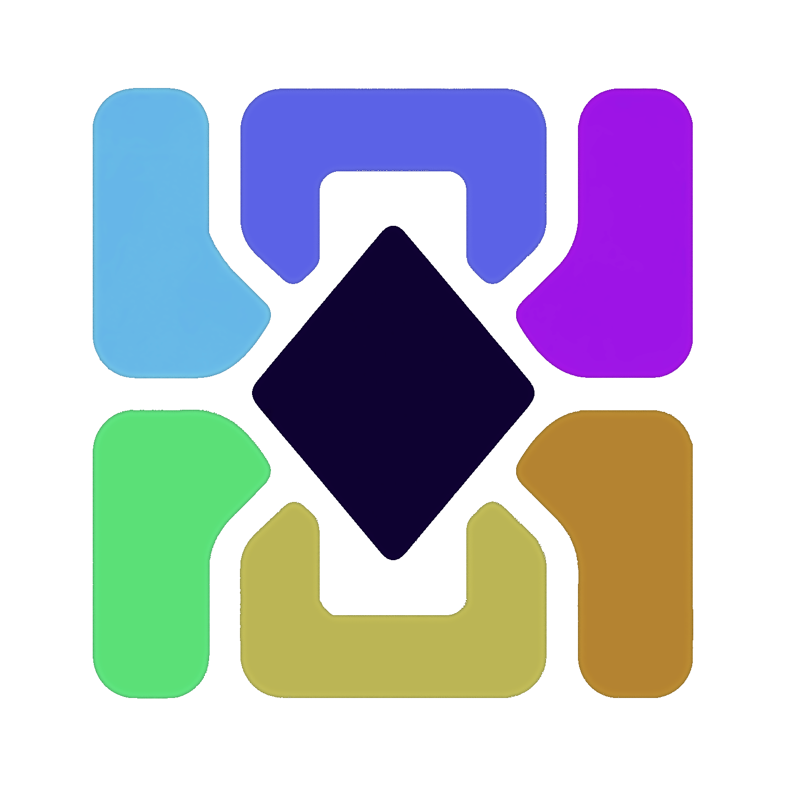

# MosaicShell - Brand Reference

> Fork of [Jax-Core/JaxCore](https://github.com/Jax-Core/JaxCore) (archived Nov 22, 2024).

**Concept:** MosaicShell replaces JaxCore's energy/core metaphor with a modular-surface one where independent tiles form one coherent shell.

> MosaicShell is a configurable desktop shell built from composable surfaces.

**Tagline:** _Your desktop, composed._

---

## Logo

Approved artwork: `MosaicShell.png`.

**Variants still needed:** compact (icon only, for exe/favicon/tray), micro (2–4 tile, <24px), monochrome (single color, for docs/terminal), wordmark-only.

**Avoid:** flames/gradients-as-energy, literal terminal prompt as primary icon, generic 9-square app grid, circular background dependency.

---

## Color

| Role               | Value     |
| ------------------ | --------- |
| Background / Shell | `#0B1020` |
| Surface            | `#151D32` |
| Raised surface     | `#202B43` |
| Text               | `#F3F6FA` |
| Muted text         | `#9BA8BC` |

**Tile accents**: teal, sky blue, violet, mint green, pale yellow, apricot orange. Six-color pastel gradient set, used only on the tiles themselves, the UI chrome stays navy/slate.

Reserve one tile color (lime or yellow) as the _only_ signal for active/success states elsewhere in the UI, so it doesn't get diluted by also being decorative.

---

## Typography

- Wordmark: `Mosaic` regular, `Shell` semibold, mixed weight, no forced caps.
- Body/UI: **IBM Plex Sans** (open-source-tool legibility, works in READMEs, installers, and compact widget labels).
- Skip Space Grotesk / Geist-style options unless a second display face is actually needed as one typeface is enough for v1.

---

## Interface rules

- Tiles: 10-16px corner radius, thin border, consistent padding.
- Grid: 8px spacing unit, repeated column widths, deliberate empty slots.
- Active/focus state: bright border or accent strip, yet never a full-card gradient fill.
- No literal circuit-board connector lines; imply connection through alignment and gaps only.

---

## Voice

Infrastructure tone, not customization-hobbyist tone. Precise, welcoming, practical.

> Build your desktop from the pieces that matter.

Avoid "spice up your desktop" framing, instead lead with control, workflow, extensibility.

---

## Landing page: Hero only

Dark canvas, mosaic of panels (clock, system status, media control, launcher, one empty slot) sharing a grid but varied tile colors; one tile mid-animation into place.

**Copy:**

> **Your desktop, composed.**
> MosaicShell is a modular desktop layer for widgets, utilities, and workflows. Arrange the pieces, tune the surface, and build an environment that fits the way you work.

**CTAs:** Explore modules · Install MosaicShell · Documentation · Contribute a module
