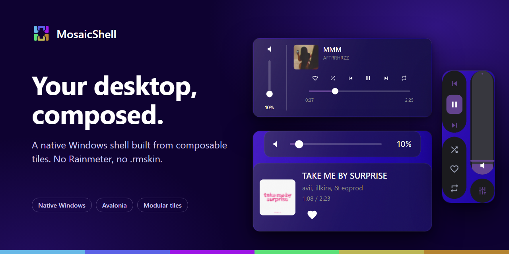
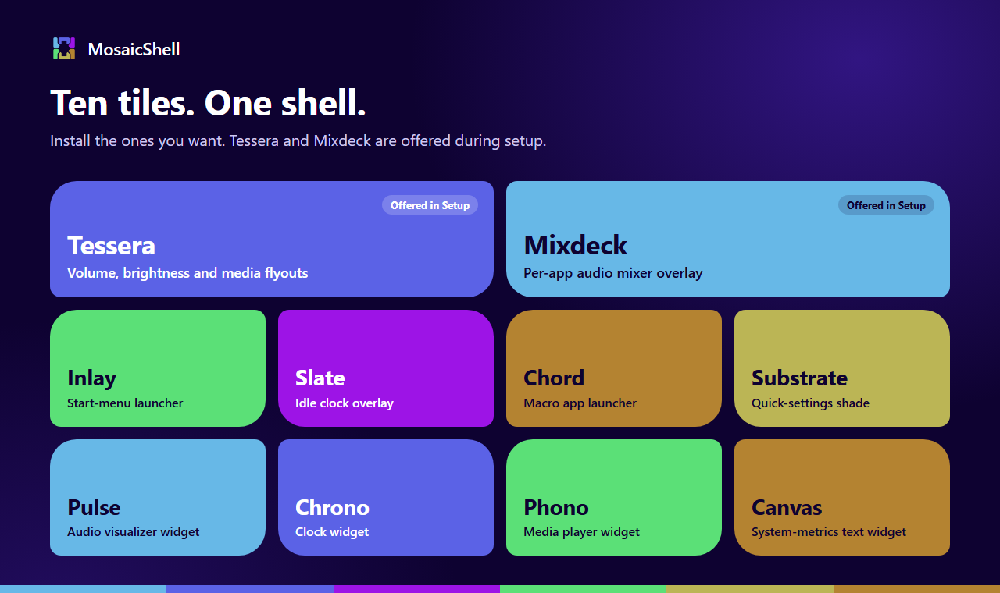
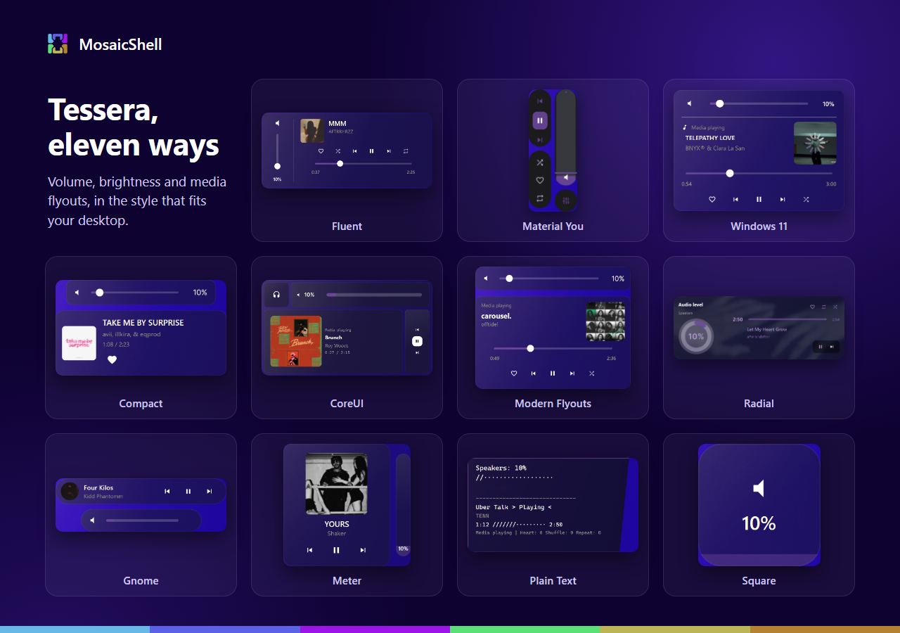

# MosaicShell

> _Your desktop, composed._




---

## About

MosaicShell is a native Windows desktop shell built from composable tiles. The Avalonia **Host** installs modules, arms tray capabilities, and opens widget overlays, with no Rainmeter and no `.rmskin`.

It continues the JaxCore idea of a modular desktop (forked from [Jax-Core/JaxCore](https://github.com/Jax-Core/JaxCore), archived November 2024). Historical Rainmeter sources live in the [Jax-Core archives](https://github.com/Jax-Core).

---

## Prerequisites

| Requirement | Minimum                                                                                                                           |
| ----------- | --------------------------------------------------------------------------------------------------------------------------------- |
| OS          | Windows 10 x64 or later                                                                                                           |
| .NET        | Not required for the release Setup (self-contained Host). Desktop Runtime 10.0 only if you build framework-dependent from source. |
| RAM         | 6 GB                                                                                                                              |

## Install

### Setup.exe (recommended)

1. Download `MosaicShell-Setup-*.exe` from [Releases](https://github.com/uairhahs/MosaicShell/releases).
2. Run the installer (per-user under `%LocalAppData%\Programs\MosaicShell`).
3. Launch MosaicShell from the Start Menu. Default modules (Tessera, Mixdeck) are offered during setup.

In-app **Check Updates** downloads the latest Setup and runs a silent upgrade.

Release tags use date-build (`yyyy.M.d-bN`, e.g. `2026.8.23-b1`), not semver.

### Portable zip (advanced)

Download `MosaicShell-Portable-*.zip`, extract, and run `Host\MosaicShell.Host.exe`. Use `Mosaicist\` next to Host to install modules from the bundled `Tiles\` folder.

### From source (developers)

```powershell
cd host
dotnet test MosaicShell.Core.Tests
dotnet run --project Mosaicist -- install-module Tessera
dotnet run --project Mosaicist -- install-module Mixdeck
dotnet run --project MosaicShell.Host
```

Local Setup builds: [packaging/README.md](packaging/README.md).

See [host/README.md](host/README.md) and [`.github/docs/parity.md`](.github/docs/parity.md).

**Honest MVP vs fidelity:** `tile_*_mvp` flags mean wiring, settings, and flagship behavior slices are in place, not full Jax-Core visual parity. Tessera layout is signed off (`tessera_layout_fidelity`; proofs in [`.github/res/Tessera/`](.github/res/Tessera/)). Other `*_layout_fidelity` flags stay false until in-repo screenshot proofs exist (see [`.github/docs/parity.md`](.github/docs/parity.md)). Install modules from the bundled `Tiles/{Id}/` stub via `Mosaicist install-module <id>` or the Setup post-install step.

---

## Known issues

### The flyout shows only the track title, with no artist or cover

Windows learns a browser's artist and cover from the page's Media Session, which the browser passes on. A browser
extension that replaces the page's Media Session hides it from the browser, so Windows only gets the page title.
KDE's **Plasma Integration** extension does this. Install the **Grout** extension (below), which reads the page
itself and is not affected, or turn the other extension off in `edge://extensions` and reload the page.

### YouTube Music: heart and thumbs-down

With the **Grout** browser extension installed, the heart and thumbs-down show and change the real state of the
track whatever the browser window is doing: covered by other windows, minimised, or in another tab. MosaicShell
registers Grout's connection for your account when it starts, so installing the extension is the only step, and it
needs no administrator rights. Grout runs only on YouTube Music, YouTube, Spotify and SoundCloud, and talks only
to MosaicShell on your computer.

Without Grout, MosaicShell falls back to reading the player's buttons through Windows accessibility, which needs
nothing installed but sees only a window that is on screen. A browser stops updating the page of a window it
cannot see, so the buttons would show a state that may no longer be the page's; MosaicShell offers nothing rather
than a wrong state. The fallback does not work when:

- **The window is covered or minimised.** The buttons come back a few seconds after the window is visible again.
- **The player is in a background tab.** Only the tab being shown can be read.
- **The window is narrow.** YouTube Music takes the buttons out of its player bar in a narrow window.

---

## Tiles

Every catalog module ships as a thin `Tiles/{Id}` install stub (`module.native.json` + README). Runtime code lives under `host/`.



| Tile      | Description                                            | License |
| --------- | ------------------------------------------------------ | ------- |
| Tessera   | Volume / brightness / media flyouts (armed capability) | MPL-2.0 |
| Mixdeck   | Per-app audio mixer overlay                            | MPL-2.0 |
| Inlay     | Start-menu launcher (pins + search)                    | MPL-2.0 |
| Slate     | Idle clock overlay                                     | MPL-2.0 |
| Chord     | Macro app launcher                                     | MPL-2.0 |
| Substrate | Quick-settings shade                                   | MPL-2.0 |
| Pulse     | Audio visualizer widget                                | MIT     |
| Chrono    | Clock widget                                           | MIT     |
| Phono     | SMTC media widget                                      | MIT     |
| Canvas    | System-metrics text widget                             | MIT     |

### Tessera styles



---

## Credits

### Original project

MosaicShell is a fork of [JaxCore](https://github.com/Jax-Core/JaxCore) by [@EnhancedJax](https://github.com/EnhancedJax), archived November 2024. Historical Rainmeter plugin credits: [Jax-Core](https://github.com/Jax-Core).

---

## Contributing

Issues and pull requests are welcome. If you are building a module or widget compatible with MosaicShell, open an issue to discuss integration.

**Development:** [`.github/docs/`](.github/docs/) (testing, parity honesty, scaling), [`docs/architecture.md`](docs/architecture.md) (how the repo is put together), [`docs/parity/README.md`](docs/parity/README.md) (per-module MVP bars), [`docs/legacy/`](docs/legacy/) (what the Rainmeter-era modules promised).

---

## License

See [LICENSE](./LICENSE).
